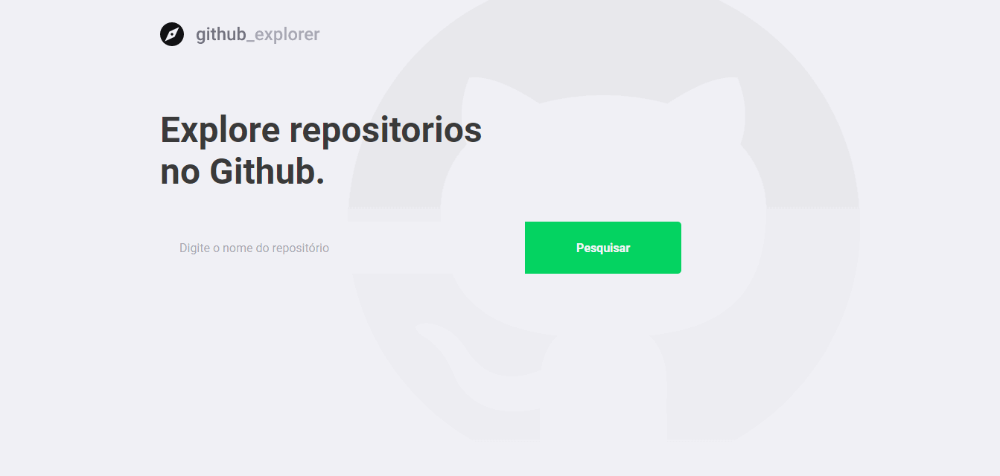

<h1 align="center">
  
</h1>

<p align="center">
  
  
</p>

<p align="center">
  
</p>

## :memo: Sobre

Essa aplicação permite que o usuário busque repositórios, veja informações sobre esse repositório (stars, forks e algumas issues) e ir até uma issue mostrada. Essa aplicação foi desenvolvida em ReactJS utilizando Typescript.

## :rocket: Tecnologias

- [ReactJS](https://reactjs.org/)
- [TypeScript](https://www.typescriptlang.org/)
- [React Router Dom](https://reacttraining.com/react-router/web/guides/quick-start)
- [Axios](https://github.com/axios/axios)
- [Styled Components](https://styled-components.com/)
- [React Icons](https://www.npmjs.com/package/react-icons)

## :gear: Rodando o projeto
``` bash
  $git clone https://github.com/frapimoneto/githubExplorer
  $cd githubExplorer
  $yarn
  $yarn start
```

Feito com ❤ por Francisco Pinto Moreira Neto 😃 [Get in touch!](https://github.com/frapimoneto)